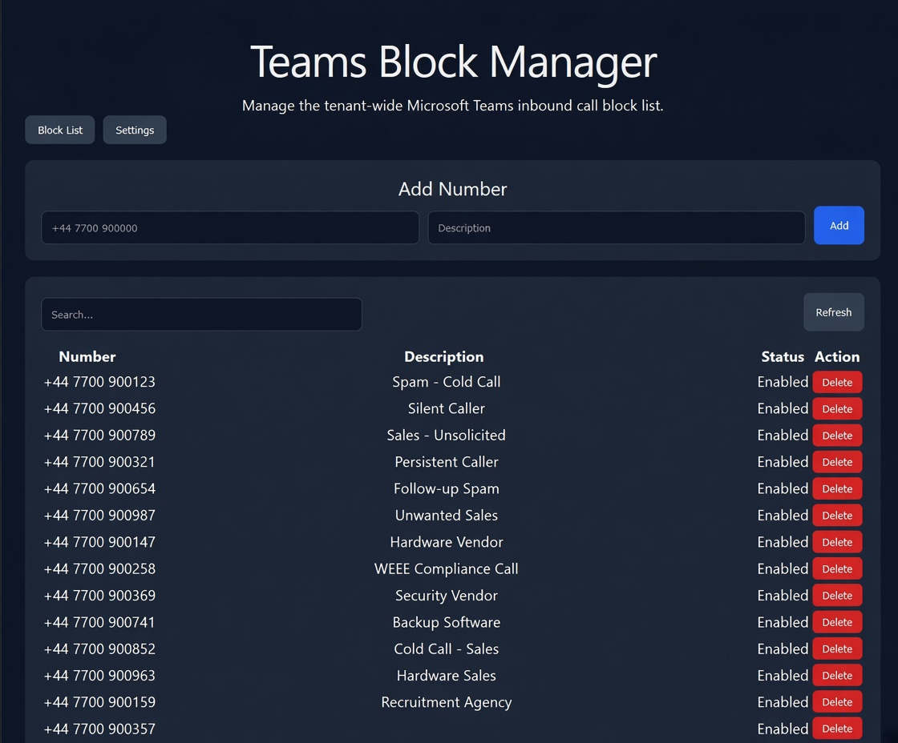
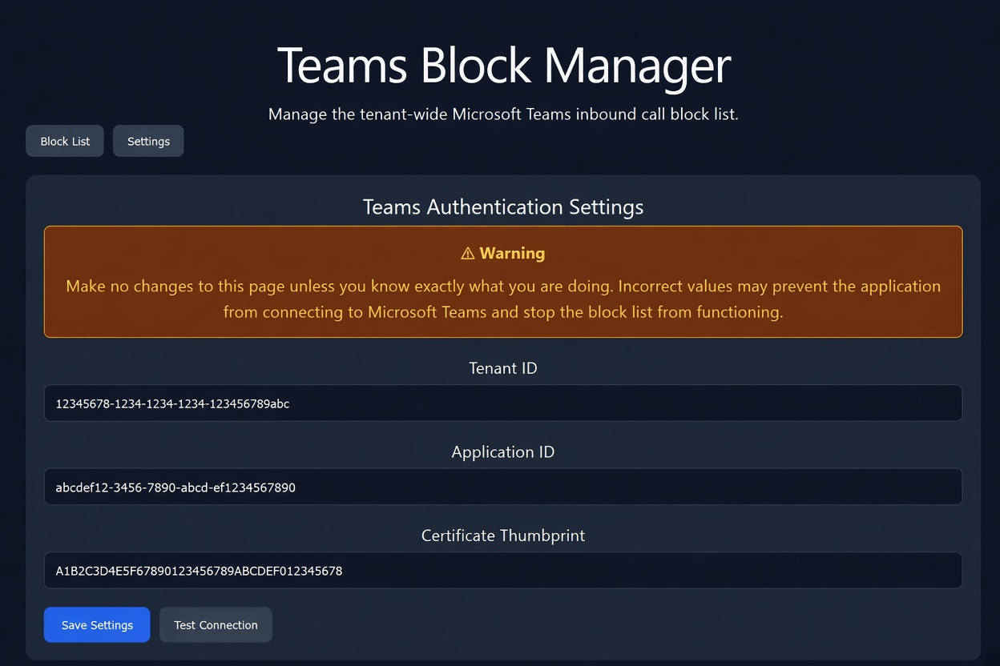

# Microsoft Teams Phone Block Manager

A web-based administration tool for managing Microsoft Teams tenant-wide blocked phone numbers.

> This project is not affiliated with, endorsed by, or supported by Microsoft.

## Features

- View blocked numbers
- Search blocked numbers
- Add blocked numbers
- Delete blocked numbers
- Teams PowerShell integration
- Certificate-based authentication
- IIS deployment support
- Web-based configuration page

## Screenshots

### Block List

### Settings

## Installation

Full installation documentation is available in the Wiki:

- https://github.com/Curtisg890/TeamsPhoneBlockManager/wiki/Installation-Guide
- https://github.com/Curtisg890/TeamsPhoneBlockManager/wiki/Troubleshooting
- https://github.com/Curtisg890/TeamsPhoneBlockManager/wiki/FAQ

## Requirements

- Microsoft Teams Phone
- PowerShell 7
- MicrosoftTeams PowerShell Module
- .NET 8
- IIS

## License

Licensed under the MIT License.
